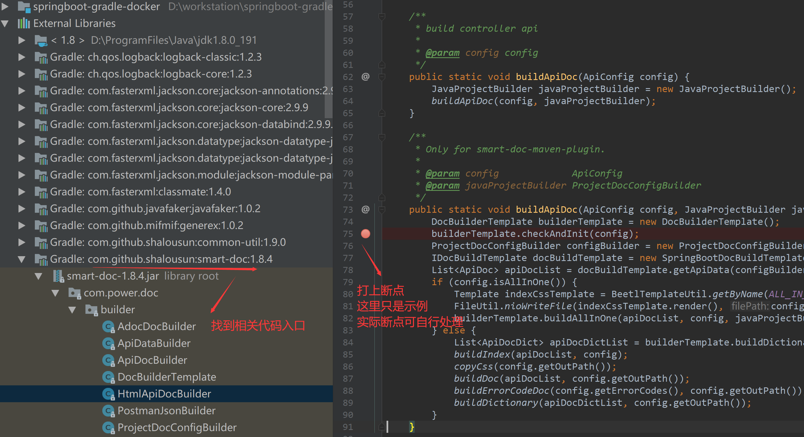
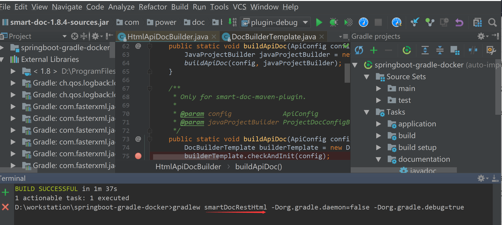
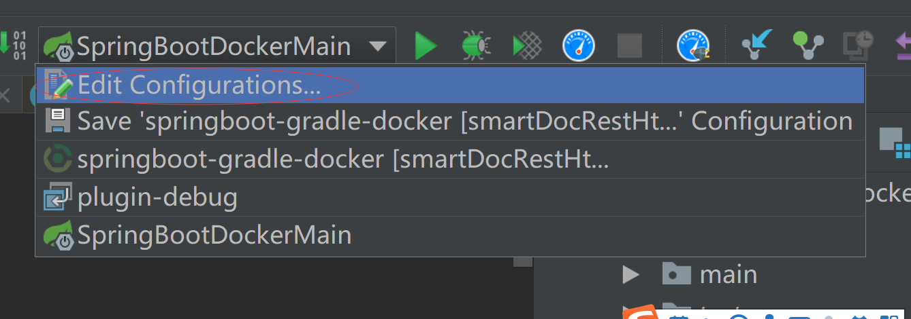
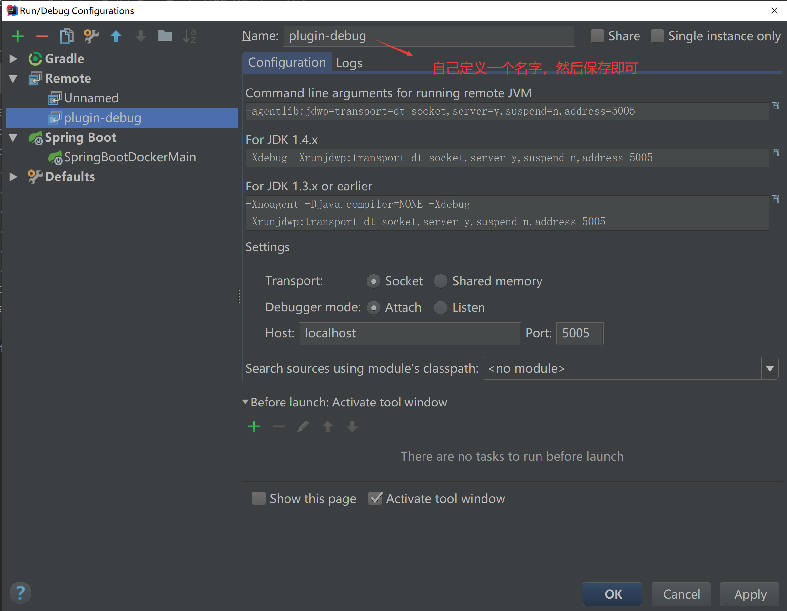
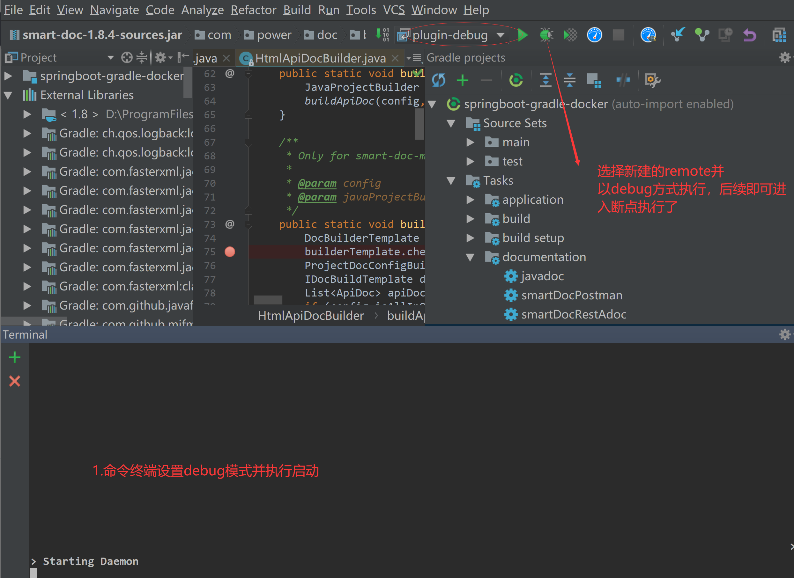

smart-doc官方的gradle插件开发正在进行中，当前完成了插件的主体结构，在优化测试中，请耐心等待发布。

# 插件调试
smart-doc-gradle-plugin插件依赖于smart-doc来完成文件的解析，smart-doc-gradle-plugin主要是为了用户更加快速简易的将smart-doc集成到项目
中生成api文档，同时smart-doc-gradle-plugin插件也是给smart-doc进行赋能，实现自动分析一些source jar的源码的路径，然后将路径赋予smart-doc方便更好的基于源码分析。

但是smart-doc面对着很多的用户，各式各样的代码我们在开发的时候并不能完全考虑到。有的代码甚至作者也从未写过。因此出现一些不明原因时通常需要用户自己进行调试。本节将介绍如何在自己的项目中通过smart-doc-gradle-plugin来调试smart-doc底层的解析。
## 添加smart-doc依赖
添加smart-doc依赖主要是方便直接查看到源码调试。未发生错误，不需要调试事并不需要在自己的项目中添加smart-doc依赖。
```
dependencies {
    testCompile 'com.github.shalousun:smart-doc:【最新版本】'
}
```
找到smart-doc源码打上断点。操作如下图：

## 命令行终端设置debug模式
gradle插件的调试并不像调试java程序和maven插件那么简单。在IDEA上直接点击debug启动相关操作就可以直接调试了。需要实现在命令行设置调试模式。操作如下图：

图中主要是打开命令行终端指定让smart-doc-gradle-plugin的某一个task使用debug模式运行, 如上图所示指定构建html文档的task来开启debug模式，命令示例如下：

```
gradlew smartDocRestHtml -Dorg.gradle.daemon=false -Dorg.gradle.debug=true
```
如果执行上面命令出现下面的错误

```
错误: 找不到或无法加载主类 org.gradle.wrapper.GradleWrapperMain
```
则请先执行下面一条命令让gradle自动下载设置好`GradleWrapper`,当然网络问题自行处理。
```
gradle wrapper
```
## 添加一个远程调试监听
点击 **Edit Configurations**

点开左边的“+”号，点击“Remote”

## 执行调试
完成上面的操作后即可用debug调试进入插件和smart-doc了，然后查看smart-doc的执行情况。操作如下图

